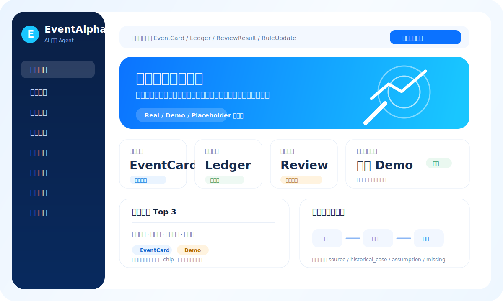
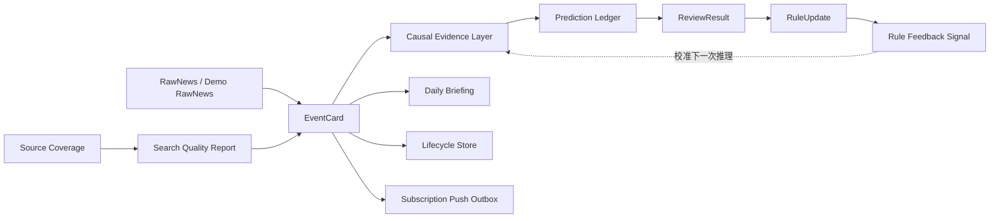

# EventAlpha

**热点事件驱动投资研究 Agent 控制台**

EventAlpha 是一个面向事件研究的本地可演示 AI 投研 Agent MVP。它把热点事件从信息源覆盖、事件识别、因果推理、预测入账、自动复盘、规则反馈到订阅推送 outbox 串成一条可审计闭环，帮助研究者回答一个关键问题：

> 这个事件为什么可能影响市场、影响哪些资产、系统当时如何判断、后续市场是否验证了这个判断？

> 本内容仅用于事件研究和市场分析，不构成投资建议。市场价格可能已提前反映相关信息，投资决策需结合个人风险承受能力。



> 上图为 README 产品预览示意。真实界面以 `streamlit run app_streamlit.py -- --demo-mode` 启动后的本地页面为准。

## 为什么值得看

- **事件研究闭环**：从 EventCard 到 Prediction Ledger，再到 ReviewResult、RuleUpdate 和 Rule Feedback，判断不会停留在一次性文本生成。
- **数据真实性可见**：页面和报告区分 `real`、`demo`、`placeholder`，不把 demo/fallback 包装成真实运行结果。
- **推理可追溯**：因果链增加 evidence layer，明确哪些步骤来自来源证据、历史案例、市场映射，哪些只是 assumption 或 missing。
- **复盘能反向校准**：ReviewResult / RuleUpdate 可以生成下一次推理的轻量置信度调整信号。
- **演示友好**：内置 demo state、日报、调度状态、历史案例、搜索质量和信息源覆盖报告，适合课堂/答辩/产品原型展示。
- **边界清楚**：不输出买卖建议、目标价、保证收益和自动交易指令；微信推送当前是 `wechat_placeholder` outbox，不伪装成真实公众号接入。

## 产品能力

| 模块 | 说明 | 当前状态 |
| --- | --- | --- |
| 首页总览 | 展示重点事件、资产研究信号、因果链、预测账本、复盘、规则和调度状态 | 可运行 |
| 事件卡片 | 汇总事件等级、可信度、影响资产、风险因素、验证指标和因果证据层 | 可运行 |
| 每日简报 | 从本地 reports 读取 Markdown/JSON 简报并产品化展示 | 可运行 |
| Prediction Ledger | 记录系统已发布的市场判断，保留事件、资产、方向、窗口、置信度和状态 | 可运行 |
| 自动复盘 | 对预测结果做方向、收益和因果有效性验证 | 可运行 |
| 规则更新 | 展示复盘后生成的规则调整记录和反馈信号 | 可运行 |
| 生命周期 | 跟踪事件从发现、验证、分析、发布、跟踪到复盘的过程 | 可运行 |
| 历史案例 | 本地历史案例库，用于类比验证和因果链校准 | 可运行 |
| 信息源覆盖 | 报告当前检查了哪些来源、哪些失败、哪些尚未接入 | MVP |
| 搜索质量评估 | 汇总 raw news、去重、聚类、EventCard、高优先级事件和 ledger 覆盖情况 | MVP |
| 订阅推送 outbox | 根据订阅者关键词/行业/资产匹配 EventCard 并生成待推送消息 | placeholder channel |

## 快速开始

```powershell
cd EventAlpha-MVP
pip install -r requirements.txt
```

生成一套本地 demo 数据：

```powershell
python scripts/run_full_demo.py --reset-demo-state --write-summary
```

生成智能体能力报告：

```powershell
python scripts/run_source_coverage_report.py --demo-mode
python scripts/run_search_quality_report.py --demo-mode
python scripts/run_rule_feedback_report.py --demo-mode
python scripts/run_push_outbox_demo.py --demo-mode
```

启动 Streamlit 控制台：

```powershell
streamlit run app_streamlit.py -- --demo-mode
```

普通只读模式：

```powershell
streamlit run app_streamlit.py
```

## 演示路径

推荐演示顺序：

1. **首页总览**：确认事件、预测账本、复盘、规则更新、数据状态是否有本地数据。
2. **事件中心**：查看 EventCard、因果链、风险因素、验证指标和 evidence layer。
3. **预测账本**：检查系统当时记录了哪些市场判断。
4. **自动复盘**：查看预测是否被市场表现验证。
5. **规则更新**：展示复盘如何生成规则修正与反馈信号。
6. **系统状态 / 调度器状态**：查看 source coverage、search quality、push outbox 和 scheduler runs。
7. **每日简报**：以简报形式收束整个事件研究过程。

## Agent 闭环



核心思想：**每一次事件判断都要被记录、复盘、修正，并在下一次推理中留下可解释的反馈痕迹。**

## 数据真实性约定

EventAlpha 的 UI 和报告统一使用三类来源标签：

- `real`：来自本地 SQLite、reports、scheduler state/runs、lifecycle store 等真实落盘数据。
- `demo`：来自 `data/demo`、`reports/demo` 或 demo fixture，用于稳定演示。
- `placeholder`：功能路径已设计，但真实后端尚未接入，例如 `wechat_placeholder`、official source placeholder。

项目不会为了页面好看而编造：

- 假趋势百分比；
- 假实时行情；
- 假媒体源数量；
- 假系统健康检查；
- 假微信公众号推送成功；
- 假投资结论。

## 关键命令

| 目标 | 命令 |
| --- | --- |
| 生成完整 demo | `python scripts/run_full_demo.py --reset-demo-state --write-summary` |
| 启动 demo 控制台 | `streamlit run app_streamlit.py -- --demo-mode` |
| 信息源覆盖报告 | `python scripts/run_source_coverage_report.py --demo-mode` |
| 搜索质量报告 | `python scripts/run_search_quality_report.py --demo-mode` |
| 复盘反馈信号 | `python scripts/run_rule_feedback_report.py --demo-mode` |
| 订阅推送 outbox | `python scripts/run_push_outbox_demo.py --demo-mode` |
| 运行核心 UI 测试 | `pytest tests/test_ui_pages_data_models.py tests/test_ui_components_data_models.py tests/test_streamlit_data_loader.py` |
| 运行新增能力测试 | `pytest tests/test_source_coverage.py tests/test_search_quality_report.py tests/test_causal_evidence.py tests/test_rule_feedback.py tests/test_push_router.py` |

报告默认写入：

```text
reports/
reports/demo/
```

demo state 默认写入：

```text
data/demo/
```

## 项目结构

```text
EventAlpha-MVP/
  app_streamlit.py                 Streamlit 产品控制台入口
  eventalpha/
    agents/                        事件抽取、评分、映射等 Agent
    data_sources/                  Mock / CSV / AkShare / provider router
    demo/                          一键 demo runner
    learning/                      复盘反馈信号
    news/                          信息源覆盖与搜索质量报告
    notification/                  订阅匹配与 push outbox MVP
    orchestration/                 单事件分析与复盘 pipeline
    reasoning/                     因果证据层
    repositories/                  SQLite schema 与 repository
    schemas/                       Pydantic 数据结构
    services/                      Ledger、卡片、规则更新等服务
    ui/                            Streamlit 数据加载、组件与页面
  scripts/                         CLI demo 与报告生成脚本
  tests/                           单元测试与 UI 数据模型测试
  docs/                            架构、能力进展与阶段文档
  data/demo/                       demo mode 本地状态
  reports/demo/                    demo mode 报告输出
  external_repos/                  参考项目，不属于 EventAlpha 主链路
```

## 当前边界

EventAlpha 当前是本地产品化 MVP，不是生产交易系统：

- 默认不真实联网；RSS/GDELT 真实抓取需要显式参数开启。
- 不提供买入、卖出、目标价、保证收益、杠杆建议或自动交易。
- 微信能力当前只生成本地 outbox，真实公众号/企业微信 API 尚未接入。
- 生产数据库、多用户权限、长期调度服务、稳定实时行情源仍是后续能力。
- 历史案例库规模有限，demo seed 会明确标注为 demo。

## 更多文档

- [Agent 能力进展](docs/agent_capability_progress.md)
- [架构说明](docs/architecture.md)
- [合规边界](docs/compliance_boundary.md)
- [端到端 Demo 流程](docs/phase7c_end_to_end_demo_flow.md)
- [Streamlit 控制台说明](docs/phase7b_streamlit_event_console.md)

## Roadmap

下一阶段最值得补的两个真实后端能力：

1. **真实信息源注册与覆盖监控**：把 RSS/GDELT/官方公告/行业源纳入统一 SourceRegistry，并记录成功率、失败原因和来源贡献。
2. **订阅推送生产接入**：将当前 `wechat_placeholder` outbox 替换为真实公众号/企业微信 API，并增加用户订阅管理、失败重试和推送审计。

长期方向：

- 生产数据库与多用户权限；
- 长期运行的 scheduler daemon；
- 稳定市场数据 provider；
- 大规模历史案例库；
- 更严格的因果证据评分与反伪相关评估。
